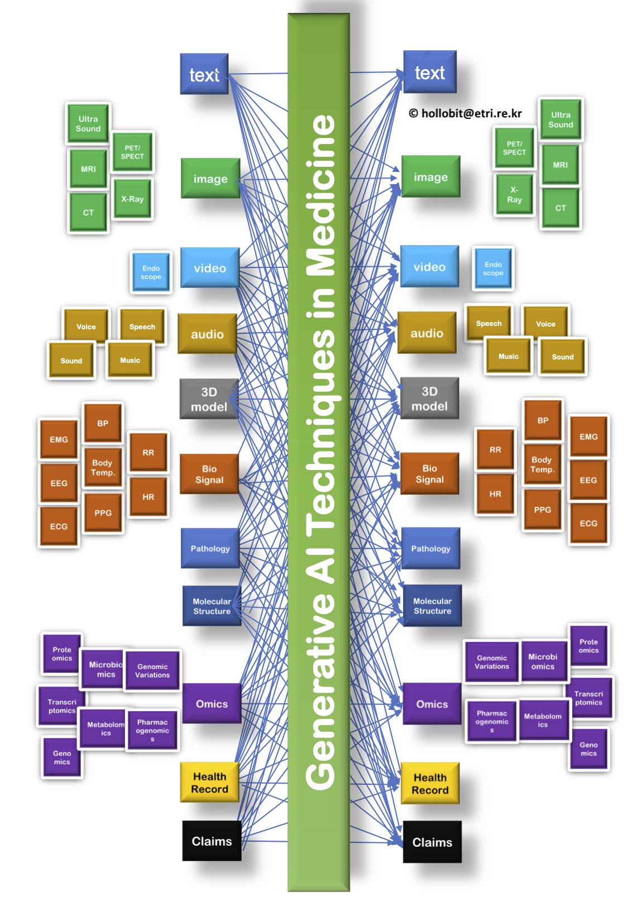

# Awesome Generative AI Techniques

A Classification and a list of papers and other resources on Generative AI Techniques. 

## Table of Content

## Contributing

This is an active repository and your contributions are always welcome!

I will keep some pull requests open if I'm not sure if they are awesome for Generative AI Techniques, you could vote for them by adding 👍 to them.

---

If you have any question about this opinionated list, do not hesitate to contact me hollobit@etri.re.kr.
